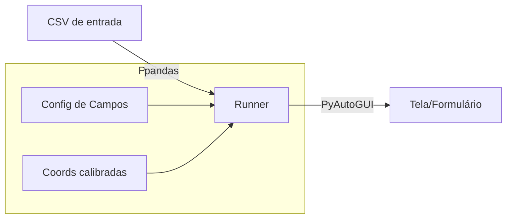

# RPA: Preenchimento de Formulários em Massa (Python + PyAutoGUI)

Automatize cliques e digitação para preencher **qualquer formulário na tela** usando coordenadas calibradas. Este projeto lê um `CSV` com os dados, clica nos campos, preenche e envia — repetindo para cada linha.

> **Stack:** Python 3.10+, PyAutoGUI, Pandas.  
> **Casos de uso:** cadastros em ERPs, CRMs, sistemas legados sem API, formulários web ou desktop.

---

## 🧱 Arquitetura



**Pastas principais**
```
.
├─ config/
│  ├─ config.json
│  └─ coords.json
├─ data/
│  └─ input.csv
├─ forms/
│  └─ sample_form.html
├─ src/
│  ├─ rpa/
│  │  ├─ actions.py
│  │  ├─ calibrate.py
│  │  └─ form_runner.py
│  ├─ utils/logger.py
│  └─ main.py
└─ requirements.txt
```

---

## 🔧 Pré-requisitos

- **Python 3.10+**
- Permissões de acessibilidade para automação (macOS/Linux)
- Ajuste seu monitor para **100% de zoom/escala** e mantenha as janelas fixas
- **Falha de segurança do PyAutoGUI**: mova o mouse para o **canto superior esquerdo** para abortar

---

## 🚀 Comece

1. **Clone/abra a pasta no VS Code**  
2. **Crie a venv e instale dependências**
   ```bash
   python -m venv .venv
   # Windows
   .venv\Scripts\activate
   # macOS/Linux
   # source .venv/bin/activate
   pip install --upgrade pip
   pip install -r requirements.txt
   ```
3. **(macOS) Conceda permissões**: Preferências do Sistema → Segurança e Privacidade → Acessibilidade → permita Terminal/VSCode.
4. **Abra o formulário de teste**  
   Dê duplo clique em `forms/sample_form.html` para abrir no navegador. Ajuste o zoom para **100%**.
5. **Calibre os campos**  
   Pelo VS Code, pressione _Run and Debug_ → **Run: calibrate** (ou no terminal):
   ```bash
   python src/main.py calibrate
   ```
   - Para cada campo, **posicione o mouse** sobre o alvo (caixa de texto/botão) e aguarde a contagem regressiva.
   - O arquivo `config/coords.json` será criado.
6. **Edite seu CSV (se quiser)**: `data/input.csv`
7. **Teste em modo simulado (sem clicar)**:
   ```bash
   python src/main.py run --dry-run
   ```
8. **Execute para valer**:
   ```bash
   python src/main.py run
   ```

> Dica: durante a execução, **não toque no mouse/teclado**. Use o *failsafe* (canto superior esquerdo) para abortar.

---

## ⚙️ Configuração

`config/config.json` define a sequência e o tipo de cada campo. Os nomes devem bater com as **colunas do CSV** (para `type: "text"`). Exemplo:

```json
{
  "fields": [
    {"name": "full_name", "type": "text", "description": "Nome completo"},
    {"name": "email", "type": "text", "description": "E-mail"},
    {"name": "phone", "type": "text", "description": "Telefone"},
    {"name": "address", "type": "text", "description": "Endereço"},
    {"name": "notes", "type": "text", "description": "Observações"},
    {"name": "submit", "type": "button", "description": "Botão Enviar/Salvar"}
  ],
  "delays": {"between_keys": 0.01, "between_fields": 0.4, "after_submit": 1.0},
  "safety": {"failsafe": true, "pause": 0.2}
}
```

- **type = text** → o runner clica e digita o valor do CSV
- **type = button** → o runner apenas clica
- Ajuste `delays` se o sistema for mais lento/rápido

---

## 🧪 Fluxo sugerido para formularios

1. Abra o sistema/URL do formulário alvo e ajuste a janela/zooom
2. Rode `calibrate` e capture: todos os campos **na ordem** e por último o **botão** de envio
3. Faça `--dry-run` para checar o cursor e logs
4. Execute **real** e monitore
5. Se mudar de monitor/zoom/tema, **recalibre**

> Opcional: crie placeholders com `Pillow` (script abaixo) e substitua pelos seus prints depois.

---

## ❗ Boas práticas e limites

- Evite tocar no mouse/teclado enquanto roda
- Desative notificações que possam roubar foco
- Use um usuário/sessão dedicada sempre que possível
- Recalibre sempre que mudar de **resolução, zoom, tema, DPI** ou posicionamento de janela
- Para páginas web complexas, considere **Selenium** (DOM) em vez de coordenadas
